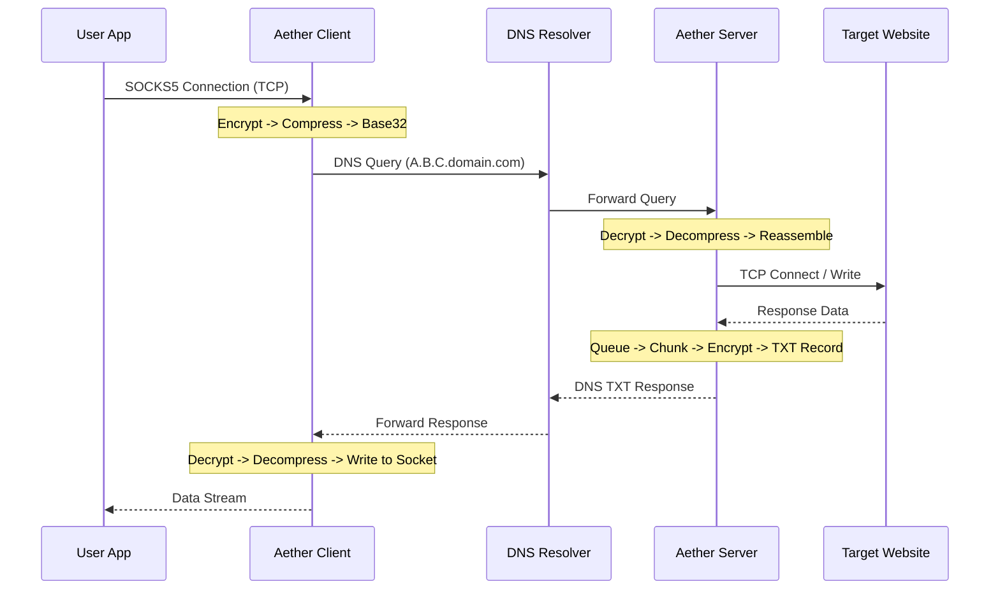

# Aether: High-Performance DNS Tunneling


> **A stealthy, high-performance DNS tunneling proxy designed for restricted environments.**  
> Optimized for Mikrotik (Container), Android (GoMobile), and Linux Servers.

Aether encapsulates TCP traffic within DNS queries (Upstream) and TXT responses (Downstream) to bypass restrictive firewalls. It prioritizes performance and stealth using **ChaCha20-Poly1305** encryption, **Zstandard** compression, and **Base32** encoding.

## 🚀 Features

*   **⚡ High Performance**: Uses **Zstd** compression with a static dictionary for small DNS payloads.
*   **🔒 Secure & Stealthy**: 
    *   **AEA Encryption**: ChaCha20-Poly1305 with unique nonces per packet.
    *   **DNS Compliance**: Fully RFC 1035 compliant (Base32 encoding, <63 char labels).
*   **🛠 Smart Routing**: Built-in Radix Tree router to bypass domestic traffic (Split Tunneling).
*   **📱 Cross-Platform**: Android-ready (exported Dialer interface) and Mikrotik-friendly (<15MB binary).
*   **♻️ Resource Efficient**: Server-side Garbage Collector cleans up inactive sessions to save RAM.

## 🏗 Architecture



## 📦 Installation & Build

Aether uses a **Makefile** to simplify cross-compilation for different targets.

### Prerequisites
*   Go 1.24+
*   Make
*   Docker (optional)

### Build Commands

```bash
# Build for Linux Server (AMD64)
make build-server

# Build for Mikrotik Container (ARMv7)
make build-mikrotik

# Build for Windows Client (AMD64)
make build-windows

# Clean build artifacts
make clean
```

## ⚙️ Usage

### 1. Server Deployment

Deploy the server on a machine with a public static IP and a domain pointing its `NS` record to it.

```bash
# Using CLI Flags
./aether-server-linux-amd64 \
  -addr "0.0.0.0:5353" \
  -domain "ns1.yourdomain.com" \
  -psk "YOUR_32_BYTE_HEX_KEY_HERE"

# Using Environment Variables (.env)
export AETHER_LISTEN_ADDR="0.0.0.0:5353"
export AETHER_DOMAIN="ns1.yourdomain.com"
export AETHER_PSK="YOUR_32_BYTE_HEX_KEY_HERE"
./aether-server-linux-amd64
```

### 2. Client Usage

Run the client on your local machine or router.

```bash
# Prepare bypass list (optional)
# echo "192.168.1.0/24" > private_ips.txt

./aether-client-windows-amd64.exe \
  -listen "127.0.0.1:1080" \
  -dns "1.2.3.4:5353" \
  -domain "ns1.yourdomain.com" \
  -psk "YOUR_32_BYTE_HEX_KEY_HERE" \
  -router "private_ips.txt"
```

Now configure your browser or OS to use **SOCKS5 Proxy** at `127.0.0.1:1080`.

## 🛠 Configuration Reference

| Flag | Env Var | Description | Default |
| :--- | :--- | :--- | :--- |
| `-psk` | `AETHER_PSK` | **Required.** 32-byte Pre-Shared Key. | - |
| `-domain` | `AETHER_DOMAIN` | **Required.** The root domain for tunneling. | `aether.local` |
| `-listen` / `-addr` | `AETHER_LISTEN_ADDR` | Local bind address. | `127.0.0.1:1080` (Client) |
| `-dns` | `AETHER_DNS_SERVER` | (Client Only) The upstream DNS server IP. | `127.0.0.1:5353` |
| `-router` | - | (Client Only) Path to CIDR file for direct access. | `iran_ips.txt` |

## 📜 License
Private / Proprietary.

## Container Deployment

The repo ships with a multi-stage Dockerfile that builds both client and server binaries and a docker-compose stack that brings them up together.

Populate .env (see .env.example) with PSK, domain, server port, DNS server, and any routing files, then run docker compose up --build.

docker compose exposes UDP port  for the server and TCP 1080 for the client. The client service mounts iran_ips.txt, uses the CIDR router list, and reuses the same .env values for domain, DNS endpoint, and PSK.
